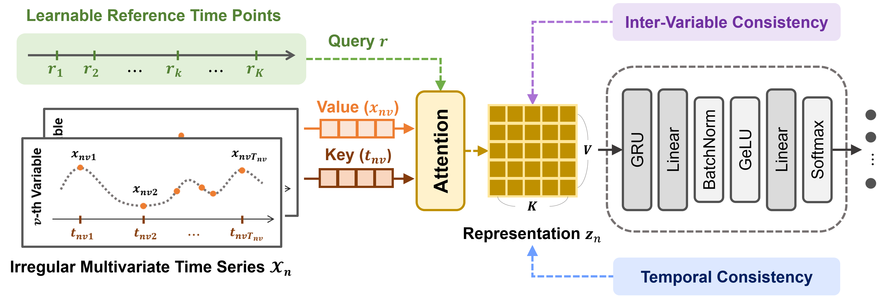
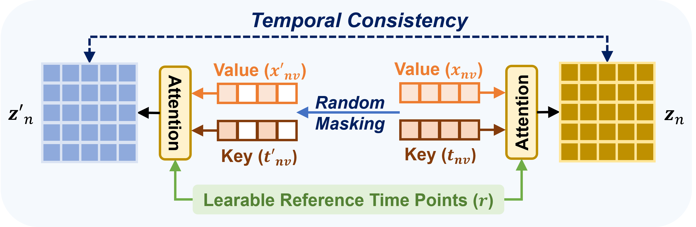
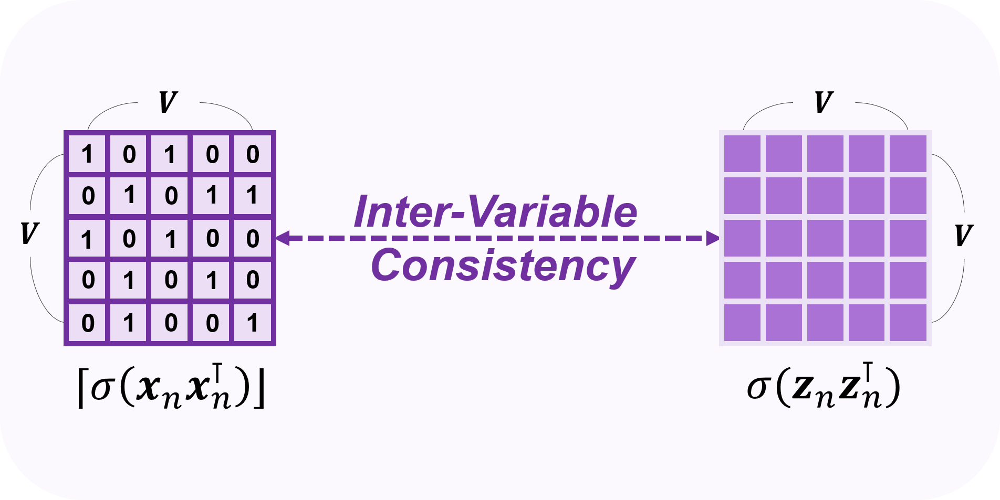

# ATENet (NeurIPS 2025)

📝 This repository is an official PyTorch implementation of **ATENet: [Adaptive Time Encoding for Irregular Multivariate Time-Series Classification](https://openreview.net/forum?id=l0kR6m9NDT&referrer=%5BAuthor%20Console%5D(%2Fgroup%3Fid%3DNeurIPS.cc%2F2025%2FConference%2FAuthors%23your-submissions))**.

## Contributions
* We design a novel interpolation-based encoder-classifier framework that learns effective representations for irregular multivariate time-series classification.
* Our encoding approach directly learns reference points, rather than manually finding the optimal ones, to capture underlying patterns within irregular time series.
* We introduce temporal and intervariable consistency regularization terms to explicitly consider intricate temporal dynamics and relationships across variables.
* The proposed method achieved state-of-the-art performance with high computational efficiency in irregular multivariate time-series classification.

> Illustration of overview of ATENet



> Illustration of temporal and inter-variable consistency regularization terms

||
---|---|

## Requirements

💡 Our code requires *Python*, *PyTorch*, *Scikit-Learn*, and *NumPy*.

> Test with:
- python == 3.9.12
- PyTorch == 1.13.0
- scikit-learn == 0.24.2
- numpy == 1.19.4
- matplotlib == 3.4.3

📁 You can download *preprocessed datasets* from [Raindrop](https://github.com/mims-harvard/Raindrop) and put them into `dataset/` folder in the following way:
- [P12 dataset] should be put into `dataset/P12data/`. For example, one of the files is located by `datasets/P12data/processed_data/arr_outcomes.npy`. The preprocessed dataset is provided in [figshare](https://doi.org/10.6084/m9.figshare.19514341.v1). The raw dataset can be downloaded from [here](https://physionet.org/content/challenge-2012/1.0.0/).
- [P19 dataset] should be put into `dataset/P19data/`. The preprocessed dataset is provided in [figshare](https://doi.org/10.6084/m9.figshare.19514338.v1). The raw dataset can be downloaded from [here](https://physionet.org/content/challenge-2019/1.0.0/).
- [PAM dataset] should be put into `dataset/PAMdata/`. The preprocessed dataset is provided in [figshare](https://doi.org/10.6084/m9.figshare.19514347.v1). The raw dataset can be downloaded from [here](http://archive.ics.uci.edu/ml/datasets/pamap2+physical+activity+monitoring).

## Training and Evaluation

💻 To train and evaluate ATENet in the paper on a dataset, run the following command:

```train
python main.py --dataset <dataset> <learn-emb> --hidden <hidden> --embed-time <embed-time> --lr <lr> --num-heads <num-heads> --alpha <alpha> --beta <beta>
```
📚 The detailed descriptions about the arguments are as following:

| Parameter             | Description  |
| --------------------- |------------- |
| dataset               | The dataset name |
| hidden                | The hidden dimensions used in the classifier (defaults to 32)|
| learn-emb             | Type of time embedding function (Sinusoidal or Learnable) |
| embed-time            | The number of reference time points and the dimension of time embedding functions (defaults to 128) |
| lr                    | The learning rate (defaults to 0.01) |
| num-heads             | The number of heads for multi-head attention mechanism (defaults to 1) |
| alpha                 | The loss weight for temporal consistency regularization (defaults to 0.1) |
| beta                  | The loss weight for inter-variable consistency regularization (defaults to 0.01) |

* *For descriptions of more arguments used in this code, run ```python main.py -h```.*

* For example, you can obtain the classification results on 'PAM' dataset as:
```train
python main.py --dataset PAM --learn-emb --embed-time 128 --lr 0.01 --num-heads 1 --alpha 0.1 --beta 0.01
```

* *You can implement all baseline methods using the source codes provided by [Raindrop](https://github.com/mims-harvard/Raindrop).*

## Citation

```
@inproceedings{lee2025adaptive,
  title={Adaptive Time Encoding for Irregular Multivariate Time-Series Classification},
  author={Lee, Sangho and Min, Kyeongseo and Son, Youngdoo and Do, Hyungrok},
  booktitle={Advances in Neural Information Processing Systems},
  volume={38},
  year={2025}
}
```

## Contributing
The code for ATENet is implemented based on the official code of [Raindrop](https://github.com/mims-harvard/Raindrop).
